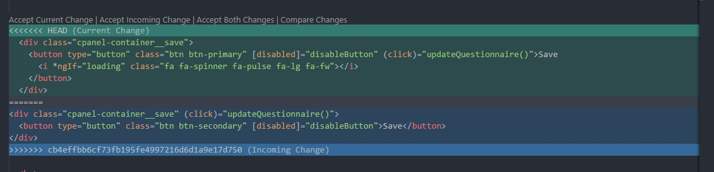

<h3 align="center">Wichtige GIT Befehle</h3>
<br>
<p>
Dokumentation für Git Befehle, Vorgänge zur Arbeit mit Feature Branch Entwicklung. 
Die <> in den Parameter sind zu entfernen und das beliebige Argument einzusetzen.
</p>

<br>

<!-- TABLE OF CONTENTS -->
<details open="open">
	<summary>Inhalt</summary>
	<ol>
		<li><a href="#branches">Branches</a>
			<ul>
				<li><a href="#auflisten">Auflisten</a></li>
				<li><a href="#erstellen">Erstellen</a></li>
				<li><a href="#auschecken">Auschecken</a></li>
				<li><a href="#unbenennen">Unbennenen</a></li>
				<li><a href="#vergleichen">Vergleichen</a></li>
				<li><a href="#löschen">Löschen</a></li>
			</ul>
		</li>
		<li><a href="#commit">Commit</a>
			<ul>
				<li><a href="#status">Status</a></li>
				<li><a href="#stage">Stage</a></li>
				<li><a href="#commit-vorgang">Vorgang</a></li>
				<li><a href="#push">Push</a></li>
				<li><a href="#rückgängig">Ruckgängigmachung</a></li>
			</ul>
		</li>
		<li><a href="#merge">Merge</a>
			<ul>
				<li><a href="#auflisten">Vorgang</a></li>
				<li><a href="#konflikte-lösen">Konflikte lösen</a></li>
				<li><a href="#abbrechen">Abbrechen</a></li>
			</ul>
		</li>
		<li><a href="#logs">Logs</a>
			<ul>
				<li><a href="#Graph">Graph</a></li>
				<li><a href="#letzte-commits">Letzte Commits</a></li>
			</ul>
		</li>
		<li><a href="#hooks">Hooks</a>
			<ul>
				<li><a href="#im-projekt-erstellen">Im Projekt erstellen</a></li>
			</ul>
		</li>
	</ol>
</details>
<br>
<br>

# Branches

## Auflisten

Lokalles Branches auflisten:

```sh
git branch
```

Remote Branches auflisten:

```sh
git branch  -r
```

Remote und lokalles Branches auflisten:

```sh
git branch  -a
```

<br>

## Erstellen

Neue Branche erstellen:

```sh
git branch <branch-name>
```

<br>

## Auschecken

In einem Branch wechseln:

```sh
git checkout <branch-name>
```

<br>

Branch erstellen und gleich auschecken:

```sh
git checkout -b <branch-name>
```

<br>

## Unbenennen

1. Lokales ausgechecktes Branch unbenennen:

```sh
git branch -m  <alte-name> <neuer-name>
```

2. Branch ins Remote hochladen:


```sh 
git push origin <neuer-name>
```

3. Upstream zurücksetzen:

```sh 
git push origin -u <neuer-name>
```
<br>

## Vergleichen

Zwei Branches vergleichen:

```sh
git diff branch1..branch2
```

<br>

## Löschen

Lokales ausgechecktes Branch löschen:

```sh
git branch -d <branch-name>
```

<br>

Remote Branch löschen:
``` sh 
git push origin --delete <branch-name>
```

<br>
<br>

# Commit

Erstellt ein Checkpoint innerhalb eines Branches auf dem man evtl. zurückgehen kann.
<br>
<br>

## Status

Zustande der geänderten Datein, ausgecheckte Branch und Konflikte ansehen:

```sh
git add mein-datei.txt
```

<br>

## Stage

Änderungen in einem Datei für Commit bereitstellen:

```sh
git add mein-datei.txt
```

<br>

## Commit Vorgang

Änderungen commiten bzw. speichern:

``` sh
git commit -m "mein-datei.txt wurde hinzugefügt"
```

<br>

## Push

Commited Änderung von eigenen Branch zum Remote senden (Github)

```sh
git push
```
<br>
Lokalle Branch zum Remote pushen: 

```sh
git push -u origin <my-local-branch>
```


<br>
Wenn jemand vorher Änderungen in selben Branch übernommen, wird die Fehlermeldung angezeigt:<br><br>

``` sh
Updates were rejected because the remote contains work that you do not have locally. This is usually caused by another repository pushing
```

<br>

**Lösung:**

<ol>
  <li>Branch mit  <code>git pull </code> aktualisieren </li>
  <li>Konflikte lösen</li>
  <li>Mit <code>git push</code> die Änderungen hochladen </li>
</ol>
<br>

Wenn die lokalle Branch nicht in origin (GitHub Repository) gesetzt ist kommt die Fehlermeldung :

``` sh
fatal: The current branch my-branch has no upstream branch.
To push the current branch and set the remote as upstream, use

```

``` sh
    git push --set-upstream origin <branch-name>
```

**Lösung**: Vorgeschlagenen Befehl ausführen
<br>
<br>
<br>


## Rückgängigmachung

Lokalle commited Änderungen rückgängig  machen. 
Die ``` --soft ``` Flagge sorgt dafür dass der geänderten Code im Datei bleibt. Um die Änderungen zu verwerfen einfach mit ``` --hard ```  ersetzen.

```sh
git reset --soft HEAD~<anzahl-commits>
```

<br>
<br>

# Merge

## Vorgang

Zwei Branches zusammenführen

<ol>
  <li>Ziel Branch auschecken und aktualisieren:</li>
  <code>git checkout ziel-branch </code>
  <br>
  <code>git pull </code>
  <li>Merge</li>
  <code>git merge <my-branch> </code>

</ol>
<br>
<br>

## Konflikte lösen

Wenn Änderungen in selben Branch in selben Datei sich wiedersprehcen wird der Merge Vorgang angehalten und die Fehlermeldung angezeigt:

```
CONFLICT (content): Merge conflict in lib/index.html
Automatic merge failed; fix conflicts and then commit the result.
```
Mit VS Code:
<ol>
<li>Datei öffnen</li>
<li> a. Datei manuell bearbeiten  oder<br> 
        b. VSCode Tool nutzen:<br><br>

<br><br>
bevorzügte Code auswählen<br>
c. Merge abbrechen:<br>
`git merge --abort` </li>
<li>
<a href="#commit">Commit</a> zum Konflikt Lösen machen
</li>
<li>Push  :boom: BÄM!</li> 
</ol>
<br>
<br>

## Abbrechen
Bei Merge Konflikte wird den Vorgang nicht automatisch abgebrochen. Bevor die zwei Branches zusammengeführt werden können müssen die Konflikte gelöst werden oder den Merge Vorgang abgebrochen werden,sonst werden commit, checkout, pull und push Befehle gesperrt.

```sh 
git merge --abort
```

<br>
<br>

# Logs 
In jeden aktive Branch können die Commit Hashes ausgegeben werden. Diese sind nützlich um die Branch auf einen bestimmten commit wiederherzustellen oder um Konflikte nachvollzuziehen.
<br>
<br>
## Graph 
Konsole Tool um die Commits und Zweigungen eines Branches darzustellen:

```sh
git log --graph --oneline
```
<br>

Detalierten Ansicht aufrufen:
```sh
git log --graph --oneline --decorate --all
```
<br>

## Letzte Commits
die letzte Anzahl von Commits ausgeben lassen:
<br>
**Befehl ohne Whitespace nachdem ~ ausführen!**

``` sh
git log --name-status HEAD~<anzahl-commits>
```
Alternativ: 

```sh
git log -<anzahl-commits> --stat
```

# Hooks 
Hooks sind Skripts, die vor oder nach der Ausführung einer Git Befehl aufgerufen werden.  Z. B nach eine Commit, vor einem Push.
<br>
<br>
## Im Projekt erstellen 
um einen Hook zu erstellen muss man ein Skript in dem beliebige Programiersprache in dem Ordner `git_hooks`. 
Das Script enthält keine extension aber eine `shebang`  zum ausführbaren Datei:
``` sh
	#!C:\"Program Files"\nodejs\node.exe
```

Die Name des Dateies muss erklären wann das Hook laufen wird. Legalle Hooks sind:
``` sh
pre-commit
post-commit
pre-merge-commit
commit-msg
pre-push
update
```
In Orthor nutzen wir die Ordner `git_hooks` um die Hooks zu versionieren. Deshalb muss die default Git Konfiguration angepasst werden:

```sh
git config core.HooksPath .\git_hooks
 ```

Siehe [Git Docs](https://git-scm.com/docs/githooks) für mehr Information

<br>