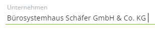

### Update Guide Version 1.0.15

#### Request API
Wenn man in der Request API ein Process Text (`t`) übergibt, wird jetzt ein `trim` durchgeführt.
Hintergrund ist, dass bei Copy & Paste meistens unabsichtlich ein Leerzeichen hinter der Eingabe eingefügt wird. 

  

Mir fällt aktuell kein Fall ein, wo ein Leerzeichen oder Absatz hinter 
Falls doch müssten für diesen Fall eine Ausnahme schaffen.
